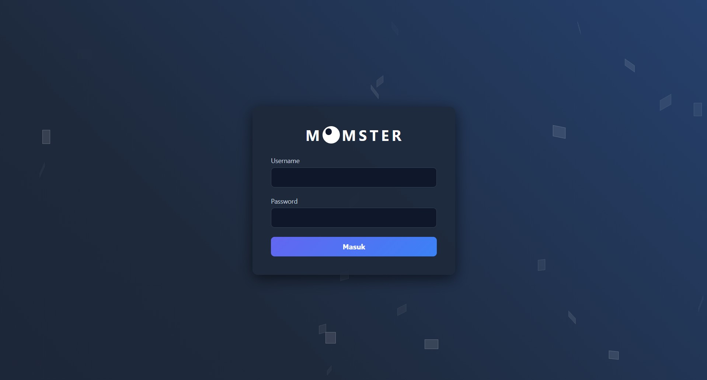
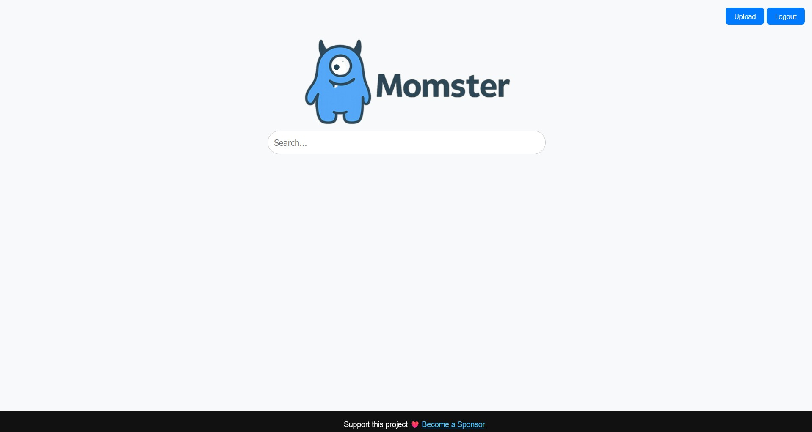
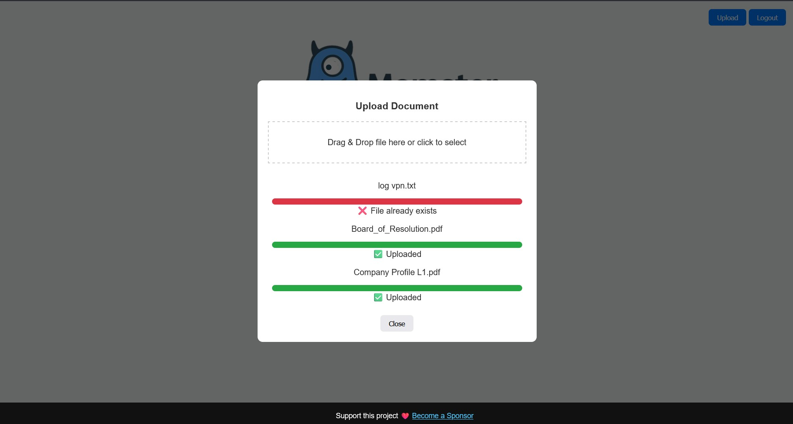
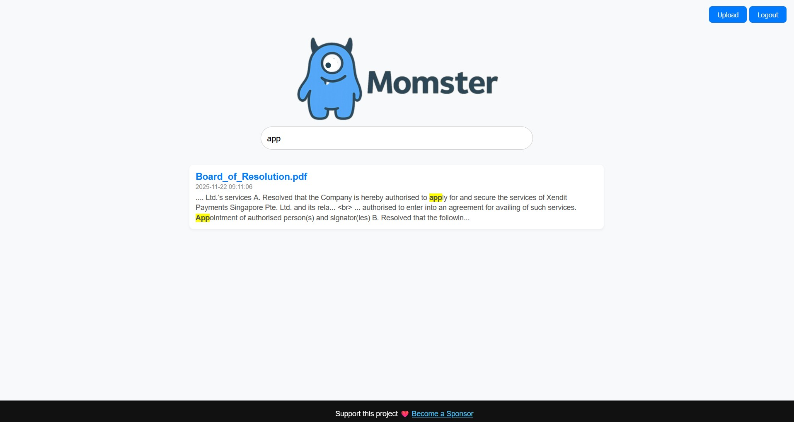

# momster
application for repository your MOM, documentation and any file text. You can search base on content of your document and download it so you can fine any document that related with what you looking for.  
Default:  
username: admin  
password: admin  
  
  
  
  

And then you can download the file

